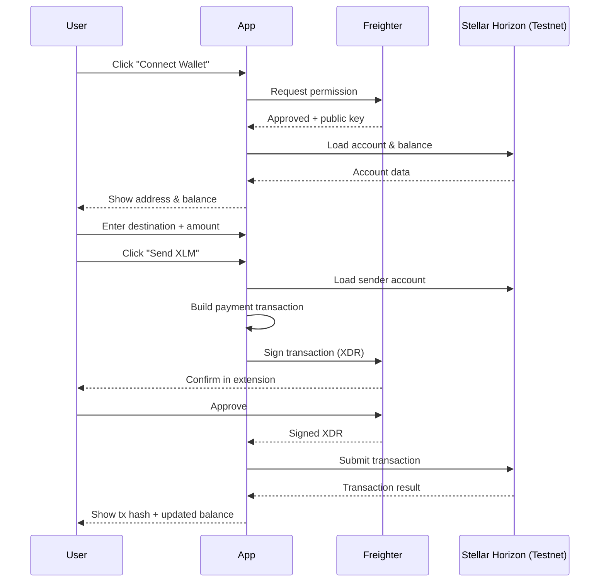
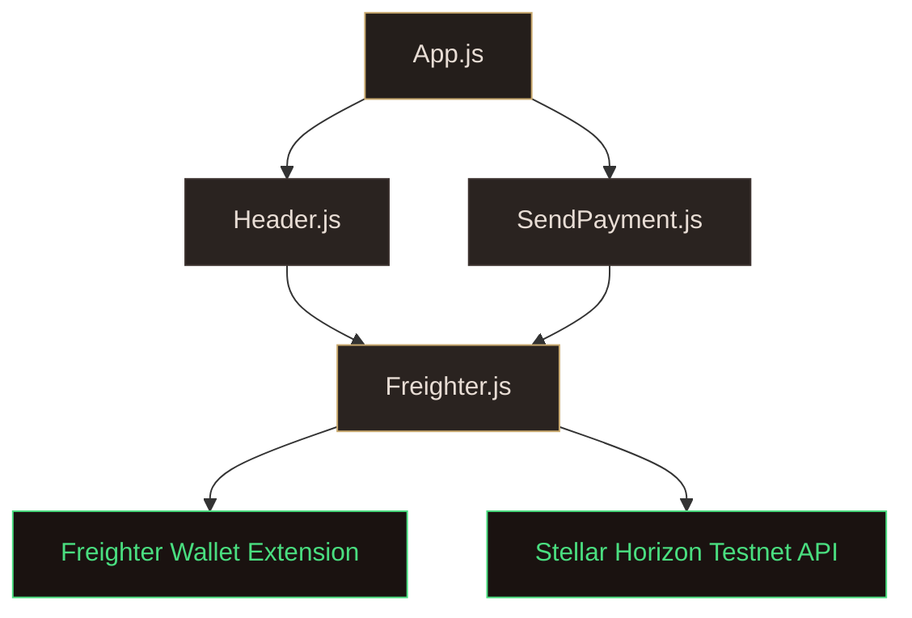

# Stellar Payment dApp

A React-based decentralized application that connects to the **Stellar Testnet** via the [Freighter](https://www.freighter.app/) wallet extension. Users can view their XLM balance and send XLM to any Stellar address.

---

## Screenshot


---

## Features

- Connect to Freighter wallet with one click
- Display wallet public key and live XLM balance
- Send XLM to any valid Stellar Testnet address
- Real-time balance refresh after transactions
- Transaction hash display with Stellar Expert link
- Error handling for insufficient funds, missing destinations, and user cancellations

---

## How It Works



---

## Architecture



---

## Project Structure

```
src/
├── App.js                  # Root component, manages wallet state
├── App.css                 # App-level styles (layout, wallet card, welcome)
├── index.js                # Entry point
├── index.css               # Global styles (reset, fonts)
└── components/
    ├── Freighter.js        # Stellar SDK & Freighter API helpers
    ├── Header.js           # Navbar with wallet connect button
    ├── Header.css          # Header styles
    ├── SendPayment.js      # Send XLM form with validation
    └── SendPayment.css     # Send payment styles
```

---

## Prerequisites

- **Node.js** (v16+)
- **npm**
- [**Freighter**](https://www.freighter.app/) browser extension installed and set to **Testnet**
- A funded Stellar Testnet account (use [Friendbot](https://friendbot.stellar.org/) to fund)

---

## Setup

```bash
cd stellar-connect-wallet
npm install
npm start
```

Opens at `https://localhost:3000` (HTTPS is required for Freighter).

---

## Usage


1. Install and open Freighter, switch to **Testnet**.
2. Click **Connect Wallet** and approve in the extension.
3. Your wallet address and XLM balance will appear.
4. Enter a valid Stellar Testnet public address and amount.
5. Click **Send XLM** and confirm the transaction in Freighter.
6. The transaction hash will be displayed with a link to view it on [Stellar Expert](https://stellar.expert/).

---

## Tech Stack

| Technology | Purpose |
|---|---|
| React 19 | UI framework |
| Stellar SDK | Transaction building & Horizon API |
| Freighter API | Wallet connection & transaction signing |
| CSS (modular) | Component-scoped styling |

---

## Important Notes

- This project uses the **Stellar Testnet** only — do NOT use real mainnet funds.
- Always confirm transactions before signing in Freighter.
- This is a learning/demo application.
