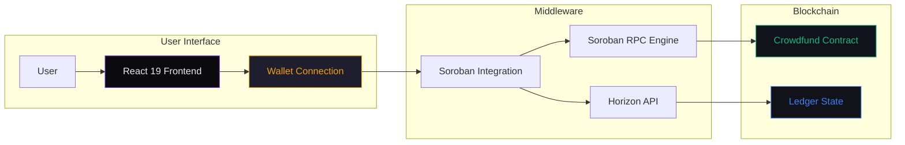
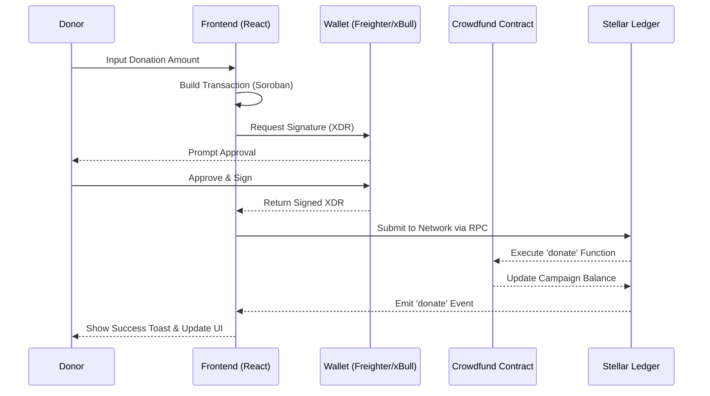

# 🌠 StellarFund | Decentralized Crowdfunding on Stellar
A top-tier, full-stack decentralized application (dApp) designed to revolutionize crowdfunding on the **Stellar Testnet**. Powered by **Soroban Smart Contracts**, StellarFund empowers creators to launch visionary projects and enables donors to contribute securely with real-time on-chain transparency.

---

## ✨ Features at a Glance

### 💎 Premium Experience
*   **Cosmic Design System**: A sleek "Cosmic Purple" interface built with vanilla CSS, featuring glassmorphism, responsive grids, and micro-animations.
*   **Real-Time Activity Feed**: Live streaming of Stellar Horizon and Soroban events (Donations, Campaign Creations, Payments).
*   **Interactive Progress**: Visual funding goals with animated progress bars reflecting live blockchain state.

### 🔌 Seamless Connectivity
*   **Multi-Wallet Selector**: One-click connection for **Freighter**, **xBull**, and **Albedo**.
*   **Friendbot Integration**: Instantly fund your testnet account with 10,000 XLM directly from the UI.
*   **Stellar Expert Integration**: Every transaction provides a direct link to the block explorer for full auditability.

### 🛡️ Institutional-Grade Logic
*   **Soroban Smart Contracts**: All core logic lives on-chain in optimized Rust/WASM.
*   **Transaction Tracker**: A guided UI walkthrough from Simulation to Finalization, ensuring users are never left in the dark.
*   **Advanced Error Handling**: Dedicated handlers for `Insufficient Funds`, `User Rejection`, and `Network Timeouts`.

---

## 🛠️ Tech Stack

| Layers | Technologies Used |
|---|---|
| **Frontend** | React 19, Vanilla CSS3, JavaScript (ES6+) |
| **Smart Contracts** | Soroban SDK (Rust), WASM |
| **Blockchain** | Stellar SDK, Horizon API, Soroban RPC |
| **Wallets** | @stellar/freighter-api, @stellar/stellar-wallets-kit |
| **Design** | HSL Custom Color Palette, Google Fonts (Inter, Mono) |

---

## 📂 Architecture Overview


```mermaid
graph LR
    subgraph Client [User Interface]
        UC[User] --> UI[React 19 Frontend]
        UI --> WC[Wallet Connection]
    end

    subgraph Service [Middleware]
        WC --> SI[Soroban Integration]
        SI --> RPC[Soroban RPC Engine]
        SI --> HOR[Horizon API]
    end

    subgraph Core [Blockchain]
        RPC --> SC[Crowdfund Contract]
        HOR --> ACC[Ledger State]
    end

    style UI fill:#0a0a0f,stroke:#7c3aed,color:#e8e6f0
    style SC fill:#12121a,stroke:#10b981,color:#10b981
    style ACC fill:#12121a,stroke:#3b82f6,color:#3b82f6
    style WC fill:#1e1e2e,stroke:#f59e0b,color:#f59e0b
```

### 💸 Donation Flow Sequence

```mermaid
sequenceDiagram
    participant U as Donor
    participant F as Frontend (React)
    participant W as Wallet (Freighter/xBull)
    participant C as Crowdfund Contract
    participant L as Stellar Ledger

    U->>F: Input Donation Amount
    F->>F: Build Transaction (Soroban)
    F->>W: Request Signature (XDR)
    W-->>U: Prompt Approval
    U->>W: Approve & Sign
    W-->>F: Return Signed XDR
    F->>L: Submit to Network via RPC
    L-->>C: Execute 'donate' Function
    C-->>L: Update Campaign Balance
    L-->>F: Emit 'donate' Event
    F-->>U: Show Success Toast & Update UI
```

---

## 🚀 Quick Start

### 1. Install Dependencies
```bash
cd stellar-connect-wallet
npm install
```

### 2. Launch the dApp
```bash
npm start
```
*Access the app at `https://localhost:3000` (HTTPS required for wallet interaction).*

### 3. Deploy Smart Contract (Optional)
```bash
cd crowdfund-contract
cargo build --target wasm32-unknown-unknown --release
stellar contract deploy --wasm target/wasm32-unknown-unknown/release/crowdfund_contract.wasm --network testnet
```

---

## 🤝 Contributing
Contributions are what make the open-source community such an amazing place to learn, inspire, and create. Any contributions you make are **greatly appreciated**.

---

## 💜 Built by Rishita Seal
Dedicated to building the future of decentralized finance on Stellar.

[](https://github.com/Pixie-19)

---

*This project is built for educational purposes on the Stellar Testnet. Please do not use real assets.*
