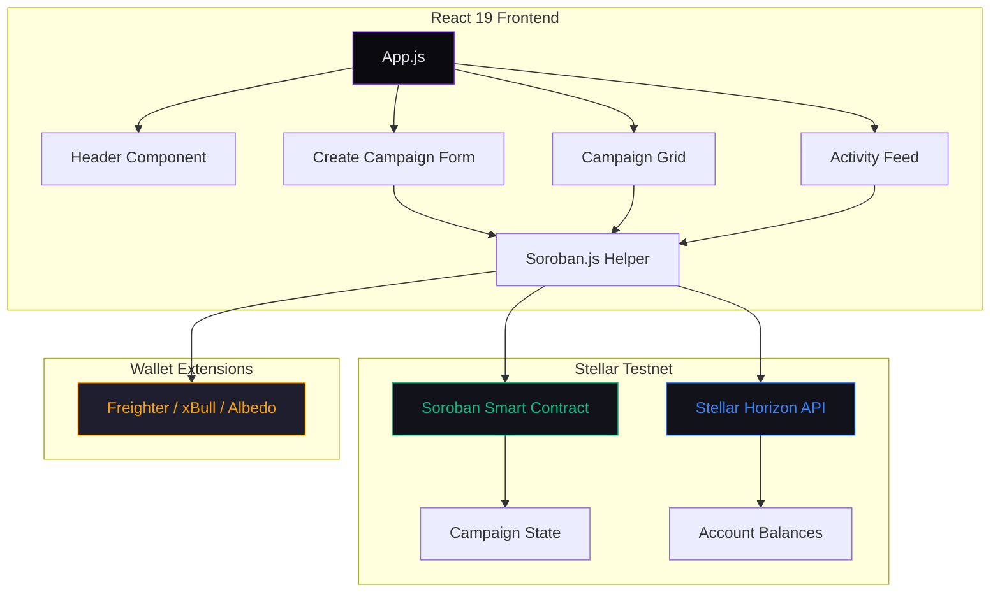

# StellarFund | Decentralized Crowdfunding on Stellar

A premium, full-stack decentralized application for crowdfunding on the **Stellar Testnet**. Built with React 19, the Stellar SDK, and Soroban smart contracts, StellarFund allows users to launch campaigns, contribute XLM, and track project progress in real-time.

---

## 🚀 Key Features

- **Soroban Smart Contracts**: Core crowdfunding logic (campaign creation, donations, goals) is handled on-chain.
- **Multi-Wallet Support**: Seamless integration with **Freighter**, **xBull**, and **Albedo** wallets.
- **Real-Time Synchronization**: Live activity feed streaming Horizon payment events and Soroban contract events.
- **Transaction Tracker**: Step-by-step visual progress tracking (Build → Simulate → Sign → Submit → Confirm).
- **Premium UI**: Modern "Cosmic Purple" dark theme with glassmorphism, smooth animations, and responsive design.
- **Robust Error Handling**: Specific handling for:
  - `WalletNotFoundError`: When no browser extension is detected.
  - `TransactionRejectedError`: When the user cancels signing.
  - `InsufficientBalanceError`: When the wallet lacks XLM for gas or payment.
- **One-Click Funding**: Integration with Stellar Friendbot for instant testnet XLM.

---

## 🛠️ Architecture


```mermaid
graph TD
    subgraph Frontend [React 19 Frontend]
        A[App.js] --> B[Header Component]
        A --> C[Campaign Grid]
        A --> D[Create Campaign Form]
        A --> E[Activity Feed]
        D --> F[Soroban.js Helper]
        C --> F
        E --> F
    end

    subgraph Blockchain [Stellar Testnet]
        F --> G[Soroban Smart Contract]
        F --> H[Stellar Horizon API]
        G --> I[Campaign State]
        H --> J[Account Balances]
    end

    subgraph Wallet [Wallet Extensions]
        F --> K[Freighter / xBull / Albedo]
    end

    style A fill:#0a0a0f,stroke:#7c3aed,color:#e8e6f0
    style G fill:#12121a,stroke:#10b981,color:#10b981
    style H fill:#12121a,stroke:#3b82f6,color:#3b82f6
    style K fill:#1e1e2e,stroke:#f59e0b,color:#f59e0b
```

---

## 📝 Smart Contract Logic (Soroban/Rust)

The contract supports the following functions:
- `create_campaign`: Initializes a new funding drive with a target, deadline, and creator.
- `donate`: Transfers XLM from donor to contract and updates campaign progress.
- `get_campaign`: Retrieves current status (raised, target, donor count, active status).
- `withdraw`: Allows project creators to claim funds once the goal is met.
- `close_campaign`: Manual closure by the creator.

---

## 📂 Project Structure

```
.
├── crowdfund-contract/      # Soroban Smart Contract (Rust)
│   ├── src/lib.rs           # Contract implementation
│   └── Cargo.toml           # Soroban dependencies
└── stellar-connect-wallet/  # React Frontend
    ├── public/              # HTML template & assets
    └── src/
        ├── App.js           # Main application logic
        ├── components/
        │   ├── Soroban.js   # Stellar SDK Integration & Error Handling
        │   ├── Header.js    # Multi-wallet navigation
        │   ├── CampaignCard.js # Funding progress visualization
        │   ├── TransactionTracker.js # Real-time status UI
        │   └── ActivityFeed.js # Live event streaming
        └── index.css        # Cosmic design system
```

---

## 🚦 Getting Started

### Prerequisites
- **Node.js** (v18+) & **npm**
- **Rust** & [**Stellar CLI**](https://developers.stellar.org/docs/build/smart-contracts/getting-started/setup)
- [**Freighter**](https://www.freighter.app/) extension (Set to **Testnet**)

### Frontend Setup
```bash
cd stellar-connect-wallet
npm install
npm start
```
*Note: The app runs on HTTPS by default to support Freighter wallet communication.*

### Smart Contract Deployment
```bash
cd crowdfund-contract
# Build to WASM
cargo build --target wasm32-unknown-unknown --release
# Deploy (Requires funded account in Stellar CLI)
stellar contract deploy --wasm target/wasm32-unknown-unknown/release/crowdfund_contract.wasm --network testnet
```

---

## 🛡️ Error Handling Implementation

The dApp implements three primary custom error classes in `Soroban.js`:

1.  **`WalletNotFoundError`**: Triggered if the user attempts to connect without a compatible wallet extension.
2.  **`TransactionRejectedError`**: Triggered if the user declines the signature request in their wallet.
3.  **`InsufficientBalanceError`**: Triggered by Horizon or Soroban simulation if the account has fewer XLM than the required amount + gas.

---

## 🌟 Tech Stack

| Technology | Purpose |
|---|---|
| **React 19** | Modern UI & State Management |
| **Soroban SDK** | Smart Contract Logic (Rust) |
| **Stellar SDK** | Transaction Building & RPC Client |
| **Freighter API** | Identity & Transaction Signing |
| **Vanilla CSS** | Custom Cosmic Design System |

---

*Built with ❤️ for the Stellar ecosystem. This is a Testnet demo. Do not send real XLM.*
